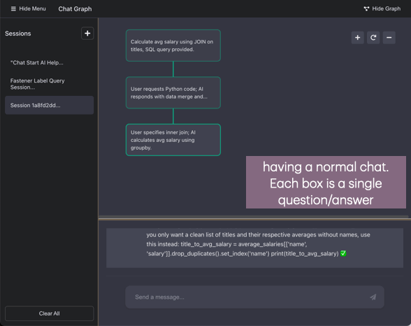

# ChatGraph

Welcome to ChatGraph! It's like ChatGPT, but with a twist that lets you and your AI buddy organize your thoughts together.

> ### A Little Backstory & Philosophy (Feel free to skip!)
>
> Ever been chatting with your LLM and suddenly a bunch of side thoughts or questions pop into your head? Or maybe you want to juggle multiple thought processes at once? I often find myself, in the middle of a chat, thinking about a bunch of side but related questions (like what does the term you just said mean or what about this... but I don't want my LLM in later chat to get confused, so I ask the question but then click on edit or delete to simply remove it from its history. Not the best user experience.)
>
> There are interesting models like OpenAI's O1 that do some neat internal thinking with chains and trees of thought. But from our (user) side, it's still just a simple back-and-forth. We trust the AI to do its thing, but wouldn't it be awesome if we could actually manage those thoughts together?
>
> That's where ThoughtNavigator comes in. It's all about giving you the reins to organize both your thoughts and the AI's in a way that makes sense to you. Think of it as a joint brainstorming session where you get to steer the conversation.

### Thought Navigation:

1. Picture your chat history as an interactive map. Each message is a point, and you can branch off from any of them to start a new conversation path. It's like creating alternate timelines for your chats!

2. Want to explore a new idea from an old conversation? Go ahead and start a new branch. Don't need a particular thought chain anymore? Just delete it.

3. By the way, everything runs locally using an open-source LLM model, so no need to worry about your data going anywhere else.



## Prerequisites

- macOS
- At least 5GB of free disk space
- Homebrew (Package Manager for macOS)
  ```bash
  # Install Homebrew if you haven't already
  /bin/bash -c "$(curl -fsSL https://raw.githubusercontent.com/Homebrew/install/HEAD/install.sh)"
  ```

- Git
  ```bash
  # Install Git using Homebrew
  brew install git
  ```

That's it! Everything else (Python, Node.js, npm, etc.) will be automatically installed during setup.

## Using ChatGraph

**Note: Currently only works on Mac**

1. Open Terminal
2. Clone the repository and navigate to the project directory:

```bash
git clone https://github.com/mohammadkazem-sadoughi/chat-graph
cd chat-graph
```

3. Set up the environment (only needs to be done once):

```bash
make setup
```

This will:
- Check system requirements (including minimum 5GB free disk space)
- Install and configure required dependencies:
  - Python 3.11 (if not already installed)
  - Node.js v16+ and npm (if not already installed)
- Install and start Ollama service
- Download the phi3 language model (~4GB)
- Set up Python virtual environment and install backend dependencies
- Install frontend Node.js dependencies

> ⚠️ **Important Note**  
> The initial setup might take several minutes, especially downloading the language model (~4GB).
> Please ensure you have a stable internet connection and sufficient disk space.

4. Run the application (do this each time you want to use ChatGraph):

```bash
make run
```

> 🔒 **Security Alert: fsevents.node**  
> On first run, macOS might show a security warning about "fsevents.node". This is normal and safe for development:
> - `fsevents` is a legitimate macOS file-watching module used by React's development server
>
> If the warning persists:
> 1. Close your current terminal
> 2. Open a new terminal window
> 3. Navigate back to the project directory: `cd path/to/ChatGraph`
> 4. Try `make run` again

5. Open your browser and go to: `http://localhost:3000`
6. When you're done, clean up with:

```bash
make clean
```